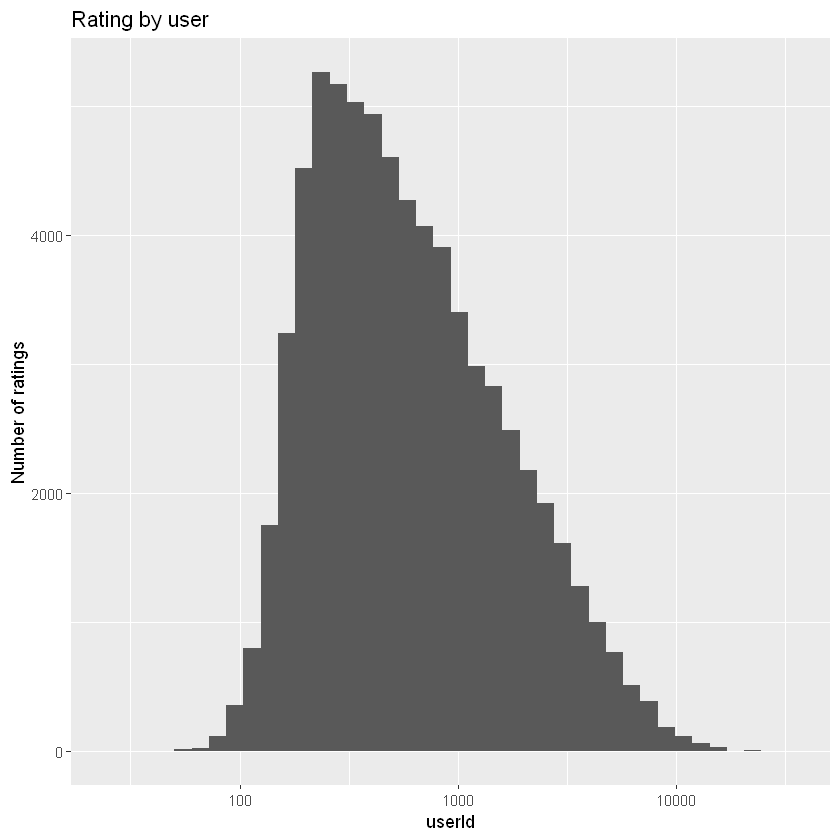

# EDX Data Science Capstone - Choose your own  - Clustering Heart Disease
---
Name : Gaël Penessot

Version : 1.0

Date 02/01/2020


# 1. Introduction
There are many industries where understanding how things group together is beneficial. For example, retailers want to understand the similarities among their customers to direct advertisement campaigns, and botanists classify plants based on their shared similar characteristics. One way to group objects is to use clustering algorithms. We are going to explore the usefulness of unsupervised clustering algorithms to help doctors understand which treatments might work with their patients.


We are going to cluster anonymized data of patients who have been diagnosed with heart disease. Patients with similar characteristics might respond to the same treatments, and doctors could benefit from learning about the treatment outcomes of patients like those they are treating. The data we are analyzing comes from the V.A. Medical Center in Long Beach, CA. To download the data, visit the following [link](https://archive.ics.uci.edu/ml/datasets/heart+Disease).

Before running any analysis, it is essential to get an idea of what the data look like. The clustering algorithms we will use require numeric data.

## 1.1. Dataset


```R
#############################
# CLUSTERING HEART DISEASE 
#############################
## Name : Gael Penessot
## Version : 1.0
## Date : 02 jan. 2020
#############################

# Load the data
heart_disease <- read.csv("heart_disease_patients.csv")

# Print the first ten rows
head(heart_disease, 10)

# dimenisons
dim(heart_disease)
```


<table>
<thead><tr><th scope=col>id</th><th scope=col>age</th><th scope=col>sex</th><th scope=col>cp</th><th scope=col>trestbps</th><th scope=col>chol</th><th scope=col>fbs</th><th scope=col>restecg</th><th scope=col>thalach</th><th scope=col>exang</th><th scope=col>oldpeak</th><th scope=col>slope</th></tr></thead>
<tbody>
	<tr><td> 1 </td><td>63 </td><td>1  </td><td>1  </td><td>145</td><td>233</td><td>1  </td><td>2  </td><td>150</td><td>0  </td><td>2.3</td><td>3  </td></tr>
	<tr><td> 2 </td><td>67 </td><td>1  </td><td>4  </td><td>160</td><td>286</td><td>0  </td><td>2  </td><td>108</td><td>1  </td><td>1.5</td><td>2  </td></tr>
	<tr><td> 3 </td><td>67 </td><td>1  </td><td>4  </td><td>120</td><td>229</td><td>0  </td><td>2  </td><td>129</td><td>1  </td><td>2.6</td><td>2  </td></tr>
	<tr><td> 4 </td><td>37 </td><td>1  </td><td>3  </td><td>130</td><td>250</td><td>0  </td><td>0  </td><td>187</td><td>0  </td><td>3.5</td><td>3  </td></tr>
	<tr><td> 5 </td><td>41 </td><td>0  </td><td>2  </td><td>130</td><td>204</td><td>0  </td><td>2  </td><td>172</td><td>0  </td><td>1.4</td><td>1  </td></tr>
	<tr><td> 6 </td><td>56 </td><td>1  </td><td>2  </td><td>120</td><td>236</td><td>0  </td><td>0  </td><td>178</td><td>0  </td><td>0.8</td><td>1  </td></tr>
	<tr><td> 7 </td><td>62 </td><td>0  </td><td>4  </td><td>140</td><td>268</td><td>0  </td><td>2  </td><td>160</td><td>0  </td><td>3.6</td><td>3  </td></tr>
	<tr><td> 8 </td><td>57 </td><td>0  </td><td>4  </td><td>120</td><td>354</td><td>0  </td><td>0  </td><td>163</td><td>1  </td><td>0.6</td><td>1  </td></tr>
	<tr><td> 9 </td><td>63 </td><td>1  </td><td>4  </td><td>130</td><td>254</td><td>0  </td><td>2  </td><td>147</td><td>0  </td><td>1.4</td><td>2  </td></tr>
	<tr><td>10 </td><td>53 </td><td>1  </td><td>4  </td><td>140</td><td>203</td><td>1  </td><td>2  </td><td>155</td><td>1  </td><td>3.1</td><td>3  </td></tr>
</tbody>
</table>


<ol class=list-inline>
	<li>303</li>
	<li>12</li>
</ol>


## 1.2. Quantifying patient differences

It is important to conduct some exploratory data analysis (EDA) to familiarize ourselves with the data before clustering. EDA will help us learn more about the variables and make an informed decision about whether we should scale the data. Because k-means and hierarchical clustering measure similarity between points using a distance formula, it can place extra emphasis on certain variables that have a larger scale and thus larger differences between points.

Exploratory data analysis helps us to understand the characteristics of the patients in the data. We need to get an idea of the value ranges of the variables and their distributions. This will also be helpful when we evaluate the clusters of patients from the algorithms.


```R
# We check if we need to scale the data
summary(heart_disease)

# Remove id
heart_disease <- heart_disease[ , !(names(heart_disease) %in% c("id"))]

# Scaling data and saving as a data frame
scaled <- scale(heart_disease)

# What do the data look like now?
summary(scaled)
```


          age             sex               cp           trestbps    
     Min.   :29.00   Min.   :0.0000   Min.   :1.000   Min.   : 94.0  
     1st Qu.:48.00   1st Qu.:0.0000   1st Qu.:3.000   1st Qu.:120.0  
     Median :56.00   Median :1.0000   Median :3.000   Median :130.0  
     Mean   :54.44   Mean   :0.6799   Mean   :3.158   Mean   :131.7  
     3rd Qu.:61.00   3rd Qu.:1.0000   3rd Qu.:4.000   3rd Qu.:140.0  
     Max.   :77.00   Max.   :1.0000   Max.   :4.000   Max.   :200.0  
          chol            fbs            restecg          thalach     
     Min.   :126.0   Min.   :0.0000   Min.   :0.0000   Min.   : 71.0  
     1st Qu.:211.0   1st Qu.:0.0000   1st Qu.:0.0000   1st Qu.:133.5  
     Median :241.0   Median :0.0000   Median :1.0000   Median :153.0  
     Mean   :246.7   Mean   :0.1485   Mean   :0.9901   Mean   :149.6  
     3rd Qu.:275.0   3rd Qu.:0.0000   3rd Qu.:2.0000   3rd Qu.:166.0  
     Max.   :564.0   Max.   :1.0000   Max.   :2.0000   Max.   :202.0  
         exang           oldpeak         slope        first_clust   
     Min.   :0.0000   Min.   :0.00   Min.   :1.000   Min.   :1.000  
     1st Qu.:0.0000   1st Qu.:0.00   1st Qu.:1.000   1st Qu.:2.000  
     Median :0.0000   Median :0.80   Median :2.000   Median :3.000  
     Mean   :0.3267   Mean   :1.04   Mean   :1.601   Mean   :3.347  
     3rd Qu.:1.0000   3rd Qu.:1.60   3rd Qu.:2.000   3rd Qu.:4.000  
     Max.   :1.0000   Max.   :6.20   Max.   :3.000   Max.   :5.000  
      second_clust      hc_clust    
     Min.   :1.000   Min.   :1.000  
     1st Qu.:2.000   1st Qu.:1.000  
     Median :4.000   Median :1.000  
     Mean   :3.353   Mean   :1.716  
     3rd Qu.:5.000   3rd Qu.:2.000  
     Max.   :5.000   Max.   :5.000  


          age               sex                cp             trestbps       
     Min.   :-2.8145   Min.   :-1.4549   Min.   :-2.2481   Min.   :-2.14149  
     1st Qu.:-0.7124   1st Qu.:-1.4549   1st Qu.:-0.1650   1st Qu.:-0.66420  
     Median : 0.1727   Median : 0.6851   Median :-0.1650   Median :-0.09601  
     Mean   : 0.0000   Mean   : 0.0000   Mean   : 0.0000   Mean   : 0.00000  
     3rd Qu.: 0.7259   3rd Qu.: 0.6851   3rd Qu.: 0.8765   3rd Qu.: 0.47218  
     Max.   : 2.4961   Max.   : 0.6851   Max.   : 0.8765   Max.   : 3.88132  
          chol              fbs             restecg             thalach       
     Min.   :-2.3310   Min.   :-0.4169   Min.   :-0.995103   Min.   :-3.4364  
     1st Qu.:-0.6894   1st Qu.:-0.4169   1st Qu.:-0.995103   1st Qu.:-0.7041  
     Median :-0.1100   Median :-0.4169   Median : 0.009951   Median : 0.1483  
     Mean   : 0.0000   Mean   : 0.0000   Mean   : 0.000000   Mean   : 0.0000  
     3rd Qu.: 0.5467   3rd Qu.:-0.4169   3rd Qu.: 1.015005   3rd Qu.: 0.7166  
     Max.   : 6.1283   Max.   : 2.3905   Max.   : 1.015005   Max.   : 2.2904  
         exang            oldpeak            slope          first_clust     
     Min.   :-0.6955   Min.   :-0.8954   Min.   :-0.9747   Min.   :-1.9168  
     1st Qu.:-0.6955   1st Qu.:-0.8954   1st Qu.:-0.9747   1st Qu.:-1.0999  
     Median :-0.6955   Median :-0.2064   Median : 0.6480   Median :-0.2831  
     Mean   : 0.0000   Mean   : 0.0000   Mean   : 0.0000   Mean   : 0.0000  
     3rd Qu.: 1.4331   3rd Qu.: 0.4827   3rd Qu.: 0.6480   3rd Qu.: 0.5338  
     Max.   : 1.4331   Max.   : 4.4445   Max.   : 2.2708   Max.   : 1.3506  
      second_clust        hc_clust      
     Min.   :-1.5903   Min.   :-0.6714  
     1st Qu.:-0.9145   1st Qu.:-0.6714  
     Median : 0.4372   Median :-0.6714  
     Mean   : 0.0000   Mean   : 0.0000  
     3rd Qu.: 1.1130   3rd Qu.: 0.2661  
     Max.   : 1.1130   Max.   : 3.0787  


# 3. Methods

In this chapter, we will study the two algorithms used in this project.

## 3.1. k-means alogrithm

k-means clustering is a method of vector quantization, originally from signal processing, that is popular for cluster analysis in data mining. k-means clustering aims to partition n observations into k clusters in which each observation belongs to the cluster with the nearest mean, serving as a prototype of the cluster. This results in a partitioning of the data space into Voronoi cells. k-Means minimizes within-cluster variances (squared Euclidean distances), but not regular Euclidean distances, which would be the more difficult Weber problem: the mean optimizes squared errors, whereas only the geometric median minimizes Euclidean distances. Better Euclidean solutions can for example be found using k-medians and k-medoids. 

The problem is computationally difficult (NP-hard); however, efficient heuristic algorithms converge quickly to a local optimum. These are usually similar to the expectation-maximization algorithm for mixtures of Gaussian distributions via an iterative refinement approach employed by both k-means and Gaussian mixture modeling. They both use cluster centers to model the data; however, k-means clustering tends to find clusters of comparable spatial extent, while the expectation-maximization mechanism allows clusters to have different shapes.

The algorithm has a loose relationship to the k-nearest neighbor classifier, a popular machine learning technique for classification that is often confused with k-means due to the name. Applying the 1-nearest neighbor classifier to the cluster centers obtained by k-means classifies new data into the existing clusters. This is known as nearest centroid classifier or Rocchio algorithm. 

## 3.2. Hierarchical clustering

Clustering tries to find structure in data by creating groupings of data with similar characteristics. The most famous clustering algorithm is likely K-means, but there are a large number of ways to cluster observations. Hierarchical clustering is an alternative class of clustering algorithms that produce 1 to n clusters, where n is the number of observations in the data set. As you go down the hierarchy from 1 cluster (contains all the data) to n clusters (each observation is its own cluster), the clusters become more and more similar (almost always). There are two types of hierarchical clustering: divisive (top-down) and agglomerative (bottom-up).

**Divisive**

Divisive hierarchical clustering works by starting with 1 cluster containing the entire data set. The observation with the highest average dissimilarity (farthest from the cluster by some metric) is reassigned to its own cluster. Any observations in the old cluster closer to the new cluster are assigned to the new cluster. This process repeats with the largest cluster until each observation is its own cluster.

**Agglomerative**

Agglomerative clustering starts with each observation as its own cluster. The two closest clusters are joined into one cluster. The next closest clusters are grouped together and this process continues until there is only one cluster containing the entire data set.

# 4. Results

## 4.1. Grouping patients with k-means (part 1)

Now that we have scaled the data, we can start the clustering process. For the k-means algorithm, it is necessary to select the number of clusters in advance.

It is also important to make sure that our results are reproducible when conducting a statistical analysis. This means that when someone runs our code on the same data, they will get the same results. Because we are doing an analysis that has a random aspect, it is necessary to set a seed to ensure reproducibility.

Reproducibility is especially important because doctors will potentially use our results to treat patients. It is vital that other analysts see where the groups come from and can verify the results.


```R
#######################################################
#    install package if not available on computer     #
#######################################################

if(!require(tidyverse)) install.packages("tidyverse", repos = "http://cran.us.r-project.org")
if(!require(ggplot2)) install.packages("data.table", repos = "http://cran.us.r-project.org")

#######################################################
#                   load packages                     #
#######################################################

library(tidyverse, warn.conflicts = FALSE)
library(ggplot2, warn.conflicts = FALSE)

# Set the seed so that results are reproducible
seed_val <- 10
set.seed(seed_val)

# Select a number of clusters
k <- 5

# Run the k-means algorithm
first_clust <- kmeans(scaled, centers = k, nstart = 1)

# How many patients are in each cluster?
first_clust$size
```


<ol class=list-inline>
	<li>24</li>
	<li>53</li>
	<li>87</li>
	<li>72</li>
	<li>67</li>
</ol>


## 4.2. Grouping patients with k-means (part 2)

Because the k-means algorithm initially selects the cluster centers by randomly selecting points, different iterations of the algorithm can result in different clusters. If the algorithm is genuinely grouping similar observations (as opposed to clustering noise), then cluster assignments will be somewhat robust between various iterations of the algorithm.

With regards to the heart disease data, this would mean that the same patients would be grouped even when the algorithm is initialized at different random points. If patients are not in similar clusters with various algorithm runs, then the clustering method is not picking up on meaningful relationships between patients.

We're going to explore how the patients are grouped with another iteration of the k-means algorithm. We will then be able to compare the resulting groups of patients.


```R
# Set the seed
seed_val <- 38
set.seed(seed_val)

# Select a number of clusters and run the k-means algorithm
k <- 5
second_clust <- kmeans(scaled, centers = k, nstart = 1)

# How many patients are in each cluster?
second_clust$size
```


<ol class=list-inline>
	<li>51</li>
	<li>48</li>
	<li>42</li>
	<li>67</li>
	<li>95</li>
</ol>


## 4.3. Comparing patient clusters

It is important that the clusters are stable. Even though the algorithm begins by randomly initializing the cluster centers, if the k-means algorithm is the right choice for the data, then different initializations of the algorithm will result in similar clusters.

The clusters from different iterations may not be the same, but the clusters should be roughly the same size and have similar distributions of variables. If there is a lot of change in clusters between different iterations of the algorithm, then k-means clustering is not the right choice for the data.

It is not possible to validate that the clusters obtained from the algorithm are accurate because there is no patient labeling. Thus, it is necessary to examine how the clusters change between different iterations of the algorithm. We're going to use some visualizations to get an idea of the cluster stabilities. That way we can see how certain patient characteristics may have been used to group patients together.


```R
# Add cluster assignments to the data
heart_disease["first_clust"] <- first_clust$cluster
heart_disease["second_clust"] <- second_clust$cluster

# Create and print the plot of age and chol for the first clustering algorithm
plot_one  <- ggplot(heart_disease, 
                    aes(x = age, 
                        y = chol, 
                        col = as.factor(first_clust))) + 
             geom_point()
plot_one 

# Create and print the plot of age and chol for the second clustering algorithm
plot_two  <- ggplot(heart_disease, 
                    aes(x = age, 
                        y = chol, 
                        col = as.factor(second_clust))) + 
             geom_point()
plot_two
```


## 4.4. Hierarchical clustering: another clustering approach

An alternative to k-means clustering is hierarchical clustering. This method works well when data have a nested structure. Heart disease patient data might follow this type of structure. For example, if men are more likely to exhibit specific characteristics, those characteristics might be nested inside the gender variable. Hierarchical clustering also does not require the number of clusters to be selected before running the algorithm.

Clusters can be selected by using the dendrogram. The dendrogram allows us to see how similar observations are to one another, and they are useful in helping us choose the number of clusters to group the data. It is now time for us to see how hierarchical clustering groups the data.


```R
# Execute hierarchical clustering with complete linkage
hier_clust_1 <- hclust(dist(scaled), method = "complete")

# Print the dendrogram
plot(hier_clust_1)

# Get cluster assignments based on number of selected clusters
hc_1_assign <- cutree(hier_clust_1, 5)
```


## 4.5. Hierarchical clustering, method 2

In hierarchical clustering, there are multiple ways to measure the dissimilarity between clusters of observations. Complete linkage records the largest dissimilarity between any two points in the two clusters being compared. On the other hand, single linkage is the smallest dissimilarity between any two points in the clusters. Different linkages will result in different clusters being formed.

We want to explore different algorithms to group our heart disease patients. The best way to measure dissimilarity between patients could be to look at the smallest difference between patients and minimize that difference when grouping together clusters. It is always a good idea to explore different dissimilarity measures. Let's implement hierarchical clustering using a new linkage function.


```R
# Execute hierarchical clustering a single linkage
hier_clust_2 <- hclust(dist(scaled), method = "single")

# Print the dendrogram
plot(hier_clust_2)

# Get cluster assignments based on number of selected clusters
hc_2_assign <- cutree(hier_clust_2, 5)
```





## 4.6. Comparing clustering results

The doctors are interested in grouping similar patients together to determine appropriate treatments. Therefore, they want clusters with more than a few patients to see different treatment options. While a patient can be in a cluster by themselves, this means that the treatment they received might not be recommended for someone else in the group.

Like the k-means algorithm, the way to evaluate hierarchical clusters is to investigate which patients are grouped together. Are there patterns evident in the cluster assignments, or do they seem to be groups of noise? We're going to examine the clusters resulting from the two hierarchical algorithms.


```R
# Add assignment of chosen hierarchical linkage
heart_disease["hc_clust"] <- hc_1_assign

# Remove the sex, first_clust, and second_clust variables
hd_simple <- heart_disease[, !(names(heart_disease) %in% c("sex", "first_clust", "second_clust"))]

# Get the mean and standard deviation summary statistics
clust_summary <- do.call(data.frame, 
                         aggregate(. ~hc_clust, data = hd_simple, 
                                   function(x) c(avg = mean(x), sd = sd(x))))
clust_summary
```


<table>
<thead><tr><th scope=col>hc_clust</th><th scope=col>age.avg</th><th scope=col>age.sd</th><th scope=col>cp.avg</th><th scope=col>cp.sd</th><th scope=col>trestbps.avg</th><th scope=col>trestbps.sd</th><th scope=col>chol.avg</th><th scope=col>chol.sd</th><th scope=col>fbs.avg</th><th scope=col>...</th><th scope=col>restecg.avg</th><th scope=col>restecg.sd</th><th scope=col>thalach.avg</th><th scope=col>thalach.sd</th><th scope=col>exang.avg</th><th scope=col>exang.sd</th><th scope=col>oldpeak.avg</th><th scope=col>oldpeak.sd</th><th scope=col>slope.avg</th><th scope=col>slope.sd</th></tr></thead>
<tbody>
	<tr><td>1         </td><td>51.41667  </td><td>8.540979  </td><td>2.783333  </td><td>0.9470625 </td><td>129.1389  </td><td>15.93800  </td><td>239.8722  </td><td>42.29228  </td><td>0.1222222 </td><td>...       </td><td>0.8444444 </td><td>0.9905826 </td><td>161.5722  </td><td>15.779214 </td><td>0.07777778</td><td>0.2685686 </td><td>0.555000  </td><td>0.7847196 </td><td>1.388889  </td><td>0.5730336 </td></tr>
	<tr><td>2         </td><td>58.11111  </td><td>7.754246  </td><td>3.763889  </td><td>0.6165112 </td><td>130.0417  </td><td>13.90657  </td><td>253.2222  </td><td>49.74476  </td><td>0.1805556 </td><td>...       </td><td>1.4027778 </td><td>0.9140488 </td><td>135.5417  </td><td>17.991342 </td><td>0.81944444</td><td>0.3873488 </td><td>1.451389  </td><td>1.0804268 </td><td>1.750000  </td><td>0.5240686 </td></tr>
	<tr><td>3         </td><td>61.00000  </td><td>3.908034  </td><td>3.916667  </td><td>0.2886751 </td><td>168.5000  </td><td>17.45904  </td><td>284.9167  </td><td>53.00336  </td><td>0.3333333 </td><td>...       </td><td>1.2500000 </td><td>0.9653073 </td><td>147.7500  </td><td>13.157266 </td><td>0.75000000</td><td>0.4522670 </td><td>2.316667  </td><td>1.4708274 </td><td>2.166667  </td><td>0.5773503 </td></tr>
	<tr><td>4         </td><td>59.00000  </td><td>9.203580  </td><td>3.571429  </td><td>0.8501112 </td><td>134.7714  </td><td>18.64070  </td><td>233.8571  </td><td>49.67136  </td><td>0.1428571 </td><td>...       </td><td>0.6857143 </td><td>0.9321521 </td><td>116.8857  </td><td>17.842071 </td><td>0.48571429</td><td>0.5070926 </td><td>2.240000  </td><td>1.3856831 </td><td>2.200000  </td><td>0.4058397 </td></tr>
	<tr><td>5         </td><td>64.75000  </td><td>2.061553  </td><td>3.250000  </td><td>0.5000000 </td><td>138.7500  </td><td>18.42779  </td><td>433.7500  </td><td>89.93470  </td><td>0.2500000 </td><td>...       </td><td>2.0000000 </td><td>0.0000000 </td><td>156.2500  </td><td> 3.774917 </td><td>0.00000000</td><td>0.0000000 </td><td>1.100000  </td><td>0.3829708 </td><td>1.500000  </td><td>0.5773503 </td></tr>
</tbody>
</table>


## 4.7. Visualizing the cluster contents

In addition to looking at the distributions of variables in each of the hierarchical clustering runs, we will make visualizations to evaluate the algorithms. Even though the data has more than two dimensions, we can get an idea of how the data clusters by looking at a scatter plot of two variables. We want to look for patterns that appear in the data and see what patients get clustered together.


```R
# Plot age and chol
plot_one <- ggplot(heart_disease, 
                   aes(x = age, 
                       y = chol, 
                       color = as.factor(hc_clust))) + 
            geom_point()
plot_one 

# Plot oldpeak and trestbps
plot_two <- ggplot(heart_disease, 
                   aes(x = oldpeak, 
                       y = trestbps, 
                       color = as.factor(hc_clust))) + 
            geom_point()
plot_two
```


# 5. Conclusion

Now that we've tried multiple clustering algorithms, it is necessary to determine if we think any of them will work for clustering our patients. For the k-means algorithm, similar clusters must be produced for each iteration of the algorithm to make sure that the algorithm clusters the signal, not the noise.

For the sake of the doctors, we also want to have multiple patients in each group so they can compare treatments. We only did some preliminary work to explore the performance of the algorithms, and it is necessary to explore further before making a recommendation. 

It is important the k-mean algorithm seems stable when running multiple iterations. This means that we would see similar groups of patients showing up in the plots from the different iterations of the algorithm. For the hierarchical clustering, we need a method that puts a balanced number of patients in each group.

Based on the above analysis, the only algorithm that shows promise is hierarchichal clustering with complete method. The two others can't be used.


```R

```
