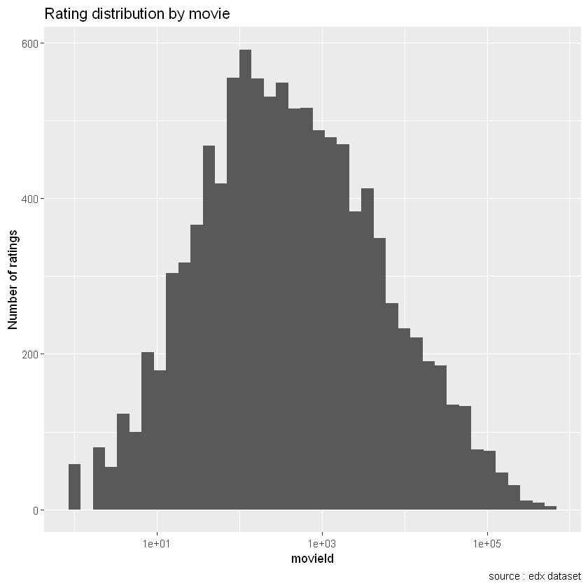

# HarvardX: PH125.9x - Data Science: Capstone
----
Name : Gaël PENESSOT

Version : 1.2

Date : 31/12/2020

# 1. MovieLens Instructions
----

The submission for the MovieLens project will be three files: a report in the form of an Rmd file, a report in the form of a PDF document knit from your Rmd file, and an R script that generates your predicted movie ratings and calculates RMSE. Your grade for the project will be based on two factors:

- Your report and script (75%)
- The RMSE returned by testing your algorithm on the validation set (25%)

Please note that once you submit your project, you will not be able to make changes to your submission.

**Report and Script (75%)**

Your report and script will be graded by your peers, based on a rubric defined by the course staff. Each submission will be graded by three peers and the median grade will be awarded. To receive your grade, you must review and grade the submissions of five of your fellow learners after submitting your own. This will give you the chance to learn from your peers.

Please pay attention to the due dates listed! The project submission is due before the end of the course to allow time for peer grading. Also note that you must grade the reports of your peers by the course close date in order to receive your grade.

**RMSE (25%)**

Your movie rating predictions will be compared to the true ratings in the validation set using RMSE. Be sure that your report includes the RMSE and that your R script outputs the RMSE.

**Honor Code**

You are welcome to discuss your project with others, but all submitted work must be your own. Your participation in this course is governed by the terms of the edX Honor Code.

**Project Due Date**

Submissions for the Movielens project are due one week before course close, on January 10, 2020, at 23:59 UTC. This allows time for peer grading to occur! Peer grades are due at course close, on January 17, 2020, at 23:59 UTC.


# 2. Introduction
---

## 2.1 Recommendation systems

Recommendation systems use ratings that users have given items to make specific recommendations. Companies that sell many products to many customers and permit these customers to rate their products, like Amazon, are able to collect massive datasets that can be used to predict what rating a particular user will give a specific item. Items for which a high rating is predicted for a given user are then recommended to that user.

## 2.2 MovieLens Dataset

The GroupLens research lab [link](https://rafalab.github.io/dsbook/large-datasets.html#fn114) generated their own database with over 20 million ratings for over 27,000 movies by more than 138,000 users. The dataset used in this project is composed of 6 features and 9000055 rows:

| Feature   | Type  | Description     |
|:---------:|:-----:|:---------------:|
| userId    | int   | from 1 to 71567 |
| movieId   | double| from 1 to 65133 |
| rating    | double| from 1 to 5     |
| timestamp | double| date            |
| title     | char  |                 |
| genres    | char  | list of genres  |


### 2.2.1 Load packages


```R
#######################################################
#    install package if not available on computer     #
#######################################################

if(!require(tidyverse)) install.packages("tidyverse", repos = "http://cran.us.r-project.org")
if(!require(caret)) install.packages("caret", repos = "http://cran.us.r-project.org")
if(!require(data.table)) install.packages("data.table", repos = "http://cran.us.r-project.org")
if(!require(recosystem)) install.packages("data.table", repos = "http://cran.us.r-project.org")
if(!require(lubridate)) install.packages("data.table", repos = "http://cran.us.r-project.org")
if(!require(ggplot2)) install.packages("data.table", repos = "http://cran.us.r-project.org")


#######################################################
#                   load packages                     #
#######################################################

library(tidyverse, warn.conflicts = FALSE)
library(caret, warn.conflicts = FALSE)
library(data.table, warn.conflicts = FALSE)
library(lubridate, warn.conflicts = FALSE)
library(ggplot2, warn.conflicts = FALSE)
```

### 2.2.2 Load dataset

The **edx** dataset has been generated with edX R script **dataset_generator.R** and saved in RDS.


```R
#######################################################
#                    load datasets                    #
#######################################################

edx <- readRDS("edx.rds")
validation <- readRDS("validation.rds")

# edx snapshot
glimpse(edx)
```

    Observations: 9,000,055
    Variables: 6
    $ userId    <int> 1, 1, 1, 1, 1, 1, 1, 1, 1, 1, 1, 1, 1, 1, 1, 1, 1, 1, 1, ...
    $ movieId   <dbl> 122, 185, 292, 316, 329, 355, 356, 362, 364, 370, 377, 42...
    $ rating    <dbl> 5, 5, 5, 5, 5, 5, 5, 5, 5, 5, 5, 5, 5, 5, 5, 5, 5, 5, 5, ...
    $ timestamp <int> 838985046, 838983525, 838983421, 838983392, 838983392, 83...
    $ title     <chr> "Boomerang (1992)", "Net, The (1995)", "Outbreak (1995)",...
    $ genres    <chr> "Comedy|Romance", "Action|Crime|Thriller", "Action|Drama|...
    


```R
# print edx dimensions
dim(edx)
```


<ol class=list-inline>
	<li>9000055</li>
	<li>6</li>
</ol>


```R
# brief edx summary
summary(edx)
```


         userId         movieId          rating        timestamp        
     Min.   :    1   Min.   :    1   Min.   :0.500   Min.   :7.897e+08  
     1st Qu.:18124   1st Qu.:  648   1st Qu.:3.000   1st Qu.:9.468e+08  
     Median :35738   Median : 1834   Median :4.000   Median :1.035e+09  
     Mean   :35870   Mean   : 4122   Mean   :3.512   Mean   :1.033e+09  
     3rd Qu.:53607   3rd Qu.: 3626   3rd Qu.:4.000   3rd Qu.:1.127e+09  
     Max.   :71567   Max.   :65133   Max.   :5.000   Max.   :1.231e+09  
        title              genres         
     Length:9000055     Length:9000055    
     Class :character   Class :character  
     Mode  :character   Mode  :character  
                                          
                                          
                                          


### 2.2.3 Data transformation

In this part of the document, we'll seperate each genre.


```R
# Extract the genre in edx datasets

edx <- edx %>%
       mutate(genre = fct_explicit_na(genres, na_level = "NA")) %>%
       separate_rows(genre, sep = "\\|")

# Extract the genre in validation datasets

validation <- validation %>%
              mutate(genre = fct_explicit_na(genres, na_level = "NA")) %>%
              separate_rows(genre, sep = "\\|")
```

The new dimensions of edx dataset is :


```R
# new dataset dimensions
dim(edx)
```


<ol class=list-inline>
	<li>72703651</li>
	<li>7</li>
</ol>


### 2.2.4 Data exploration

In this part of the document, we'll explore the edx data set. 


```R
# histogram of ratings

edx %>% select("rating") %>% 
        ggplot(aes(x = rating)) +
            geom_histogram(binwidth = 0.2) +
            ggtitle("Rating distribution") +
            scale_x_continuous(breaks = seq(0, 5, by = 0.5)) +
            labs(x = "Rating", y = "Number of ratings", caption = "source: edx dataset")
```


```R
# histogram of ratings by movieId

edx %>% count(movieId) %>% 
        ggplot(aes(n)) + 
            geom_histogram(bins = 40) +
            scale_x_log10() + 
            ggtitle("Rating distribution by movie") +
            labs(x="movieId" , 
                 y="Number of ratings", caption = "source : edx dataset")
```





```R
# histogram ratings by userId

edx %>% count(userId) %>% 
        ggplot(aes(n)) + 
            geom_histogram( bins = 40) +
            scale_x_log10() + 
            ggtitle("Rating by user") +
            labs(x = "userId" , 
                 y = "Number of ratings")
```


# 3. Method
---

The aim of this section is to explain the methodology through differents Machine Learning algorithms used in this project and to present the metric for the model performance evaluation.


## 3.1 Algorithms

The MovieLens dataset is widely used and there are multiple algorithm benchmarks available on the Internet. I chosed to used only two type of algorithms :

- A quite simple one : Regression model
- A more advanced one : Matrix Factorization with Gradient Descent

It is interesting to see the gap in term of performance between those two algoritms.

### 3.1.1 Regression Models

We followed the same approach than the one described in Rafala's DS Book in order to build our regression models as the simplest recommendation systems. We started from considering the same rating for all movies and users with all the differences explained by random variation $Y_{u,i}=μ+ε_{u,i}$ and thus, modelling successively the impact of the different features.

**"Movie Effect"**

We know that some movies are generally rated higher than others, we can augment our previous model by adding the term bi to represent average ranking for movie i:

$$Y_{u,i} = μ + b_{i} + ε_{u,i}$$

where :
- $μ$ is the rating for all movies
- $b_{i}$, $b_{s}$ effects or bias, movie-specific effect.
- $ε_{u,i}$ independent errors sampled from the same distribution centered at 0

**"Movie and user effect"**

We also know that some users are more active than others at rating movies. This implies that an additional improvement to our model may be :

$$Y_{u,i} = μ + b_{i} + b_{u} + ε_{u,i}$$

where :

- $μ$
- $b_{i}$, $ε_{u,i}$ are defined as in (1)
- $b_{u}$ user-specific effect

**"Movie, user and genre effect"**

We also know that some users are more active than others at rating movies. This implies that an additional improvement to our model may be :

$$Y_{u,i} = μ + b_{i} + b_{u} + b_{g} + ε_{u,i}$$

where :

- $μ$
- $b_{i}$, $ε_{u,i}$ are defined as in (1)
- $b_{u}$ user-specific effect
- $b_{g}$ genre-specific effect


### 3.1.2 Matrix Factorization with Gradient Descent

Matrix Factorization with Gradient Descent is a technique used to solve recommender system problem. The main idea is to approximate the matrix $R_{m×n}$ by the product of two matrices of lower dimension, $P_{k×m}$ and $Q_{k×n}$ such that :

$$R≈P′Q$$

Let $p_{u}$ be the u-th column of $P$, and $q_{v}$ be the v-th column of $Q$, then the rating given by user $u$ on item $v$ would be predicted as $p′_{u}q_{v}$. A typical solution for $P$ and $Q$ is given by the following regularization problem as defined in Chin et al(2015) :

$$min_{P,Q} ∑(u,v)∈R[f(p_{u},q_{v};r_{u,v})+ μ_{P}||p_{u}||_1 + μ_{Q}||q_{v}||_1 + \frac{λ_{P}}{2}||p_{u}||_2^2+λ_{Q}2||q_{v}||_2^2]$$

where $(u,v)$ are locations of observed entries in $R$, $r_{u,v}$ is the observed rating, $f$ is the loss function, and $μ_{P}$, $μ_{Q}$, $λ_{P}$, $λ_{Q}$ are penalty parameters to avoid overfitting.

Matrix $P$ represents latent factors of users. So, each k-elements column of matrix $P$ represents each user. Each k-elements column of matrix $Q$ represents each item. To find rating for item $i$ by user $u$ we simply need to compute two vectors: $P[,u]’ x Q[,i]$. Further descriptions of this technique and the recosystem package are available in the following [link](https://cran.r-project.org/web/packages/recosystem/vignettes/introduction.html)

## 3.2 Model evaluation

To check model performance, I'll seek to evaluate how close our predictions are to the true rating values in the validation set. For this, we take into account the Root Mean Square Error (RMSE).

To construct the RMSE, you first need to determine the residuals. Residuals are the difference between the actual values and the predicted values. We denoted them by $\widehat{y}_{u,i} − y_{u,i}$ where $y_{u,i}$ is the observed value for the ith observation and $\widehat{y}_{u,i}$ is the predicted value.

They can be positive or negative as the predicted value under or over estimates the actual value. Squaring the residuals, averaging the squares, and taking the square root gives us the RMSE. We then use the RMSE as a measure of the spread of the $y$ values about the predicted $\widehat{y}$ value.

$$RMSE = \sqrt{\frac{1}{N}.\displaystyle\sum_{u,i}^{} \widehat{y}_{u,i} − y_{u,i}}$$


```R
# the RMSE function is defined as :

RMSE <- function(measured_ratings, 
                 predicted_ratings){
    sqrt(mean((measured_ratings - predicted_ratings)^2))
  }
```

# 4. Results
---

In this chapter, we will use the algorithm described in the method chapter. For each algorithm, we will calculated the RMSE to check if the performance level.


## 4.1 Loading packages


```R
# load recosystem
library(recosystem, warn.conflicts = FALSE)
```

## 4.2 Regression Model Implementation

In this section, we code the different regression models detailed in M. Rafara's DS Book (in particular, chapter 33 Large Datasets, paragraph 7 Recommendation Systems [link](https://rafalab.github.io/dsbook/large-datasets.html)).
We'll test here 3 levels of complexity in our regression model :
- model 1 with movie feature
- model 2 with movie and user features
- model 3 with movie, user and genre features

### 4.2.1 Regression - model 1


```R
######################################################
#               Evaluate movie effect                #
######################################################

# the first step is to calculate the average of all ratings in the dataset
mu <- mean(edx$rating)

# next we have to evaluate b_i coefficient
movie_avgs <- edx %>% 
              group_by(movieId) %>% 
              summarize(b_i = mean(rating - mu))

# finally, predictions are calculated
predicted_ratings_bi <- mu + validation %>% 
                        left_join(movie_avgs, by = 'movieId') %>% .$b_i

# RMSE for this first model is then evaluated 
RMSE_reg1 <- format(RMSE(validation$rating, predicted_ratings_bi), 
                    digits = 5, 
                    nsmall = 2)  
RMSE_reg1 
```


'0.94107'


**The RMSE of model 1 is : 0.94107**

Let's check if the more complex is the model, the best RMSE we have.

### 4.2.2 Regression - model 2


```R
######################################################
#          Evaluate movie and user effect            #
######################################################

# now it is time to evaluate the b_u coefficient
user_avgs <- edx %>%  
            left_join(movie_avgs, by = 'movieId') %>%
            group_by(userId) %>%
            summarize(b_u = mean(rating - mu - b_i))

# predictions are calculated
predicted_ratings_bu <- validation %>% 
                        left_join(movie_avgs, by = 'movieId') %>%
                        left_join(user_avgs, by = 'userId') %>%
                        mutate(pred = mu + b_i + b_u) %>% .$pred


# RMSE for this second model is then evaluated 
RMSE_reg2 <- format(RMSE(validation$rating, predicted_ratings_bu), 
                    digits = 5, 
                    nsmall = 2)  
RMSE_reg2
```


'0.86337'


**The RMSE of model 2 is : 0.86337**

This model is better. There is an other variable to check : the genre. 

### 4.2.3 Regression - model 3


```R
######################################################
#      Evaluate movie, user and genre effects        #
######################################################

# we calculate the coefficient associated to the genre feature 

genre_avg <- edx %>%
             left_join(movie_avgs, by = 'movieId') %>%
             left_join(user_avgs, by = 'userId') %>%
             group_by(genre) %>%
             summarize(b_g = mean(rating - mu - b_i - b_u))

# we compute the predicted ratings on validation dataset
   
predicted_ratings_bg <- validation %>%
                        left_join(movie_avgs, by = 'movieId') %>%
                        left_join(user_avgs, by = 'userId') %>%
                        left_join(genre_avg, by = 'genre') %>%
                        mutate(pred = mu + b_i + b_u + b_g) %>% .$pred

# RMSE for this second model is then evaluated 

RMSE_reg3 <- format(RMSE(validation$rating, predicted_ratings_bg), 
                    digits = 5, 
                    nsmall = 2)  
RMSE_reg3
```


'0.86327'


**The RMSE for our last regression is 0.86327**

We can see that taking into account the genre variable has a small impact on results.


### 4.2.4 Summary of regression results

The results obtained for the different regressions are below :

| Regression model | RMSE Score     |
|:----------------:|:--------------:|
| 1                |     0.94107    |
| 2                |     0.86337    |
| 3                |     0.86327    |

Although these algorithm are quite simple, there are good enough to meet the Capstone goals in terms of RMSE performance.

## 4.3 Matrix Factorization with Gradient Descent


```R
######################################################
#      Evaluate movie, user and time effect          #
######################################################

# we create a subset of edx to select only user, movie and rating columns
edx_subset <- edx %>% select("userId", "movieId", "rating")

# glimpse(ratings_data)

# we create a test set (20%) and a train set (80%)
smp_size <- floor(0.8 * nrow(edx_subset))
train_ind <- sample(1: nrow(edx_subset), size = smp_size)

train <- edx_subset[train_ind, ]
test <- edx_subset[-train_ind, ]

# we specify user_index, item_index and rating for train data
train_data <- data_memory(user_index = train$userId, 
                          item_index = train$movieId, 
                          rating = train$rating, 
                          index1 = T)

# we specify user_index, item_index and rating for test data
test_data <- data_memory(user_index = test$userId, 
                         item_index = test$movieId, 
                         rating = test$rating, 
                         index1 = T)

# we build the recommander object
recommender <- Reco()

# we train the model 
recommender$train(train_data, opts = c(dim = 30, costp_l2 = 0.1, costq_l2 = 0.1, 
                                       lrate = 0.1, niter = 100, nthread = 6, verbose = F))

# let's make predictions on test set
test$prediction <- recommender$predict(test_data, out_memory())
```

    Observations: 23,371,423
    Variables: 3
    $ userId  <int> 1, 1, 1, 1, 1, 1, 1, 1, 1, 1, 1, 1, 1, 1, 1, 1, 1, 1, 1, 1,...
    $ movieId <dbl> 122, 122, 185, 185, 185, 292, 292, 292, 292, 316, 316, 316,...
    $ rating  <dbl> 5, 5, 5, 5, 5, 5, 5, 5, 5, 5, 5, 5, 5, 5, 5, 5, 5, 5, 5, 5,...
    


```R
# RMSE calculated with test set
RMSE_MFGD <- format(RMSE(test$rating, test$prediction), 
                    digits = 5, 
                    nsmall = 2)  
RMSE_MFGD
```


'0.78108'


```R
# we build a subset to select only user, movie and rating colunms
validation2 <- validation %>% select("userId", "movieId", "rating")

# we prepare the validation data set
validation_data <- data_memory(user_index = validation2$userId, 
                               item_index = validation2$movieId, 
                               rating = validation2$rating, 
                               index1 = T)

validation2$pred <- recommender$predict(validation_data, out_memory())

# we calculate RMSE on validation set
RMSE_MFGD <- format(RMSE(validation2$rating, validation2$pred), 
                    digits = 5, 
                    nsmall = 2)  
RMSE_MFGD
```


'0.80788'


**The RMSE for Matrix Factorization with Gradient Descent algorithm is : 0.80788**

# 5. Conclusion
---

Two kind of algorithm have been studied in this project :
- simple ones : regression with one to three variables
- a more advanced one : Matrix factorization with gradient descent 

For both, RMSE performance was good enough to reach a RMSE < 0.8649.


```R

```
